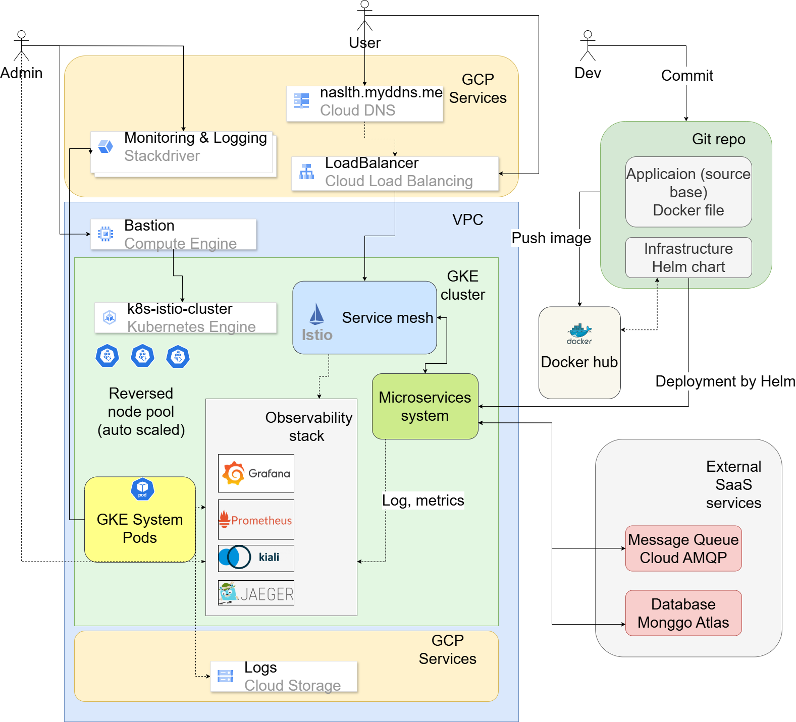
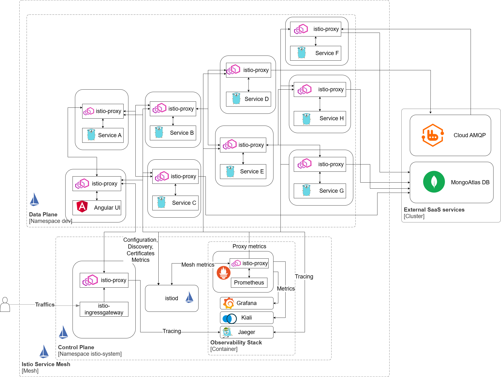

 

  <h3 align="center"><strong>Kubernetes Istio Demo</strong></h3>

  
<strong>Table of Contents</strong>

  <ol>
    <li>
      <a href="#introduction">Introduction</a>
    </li>
    <li>
      <a href="#prerequisites">Prerequisites</a>
    </li>
    <li>
      <a href="#architecture-overview">Architecture Overview</a>
    </li>
    <li><a href="#license">License</a></li>
  </ol>

 

## Introduction
This project demonstrates the use of Istio with Kubernetes to manage microservices for my Engineering thesis.

## Prerequisites
- istioctl
- helm
- gcloud SDK
- kubectl 

## Architecture Overview
1. Overview of system deployment architecture on Google Cloud Platform

2. Overview of system architecture deployment with Service Mesh Istio

## License
[MIT](https://choosealicense.com/licenses/mit/)
